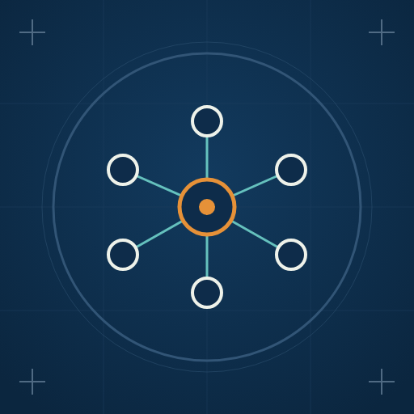
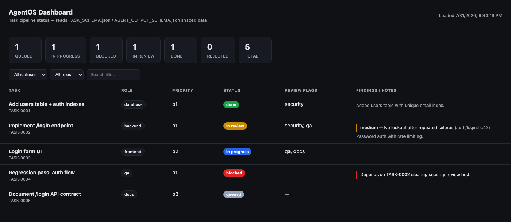
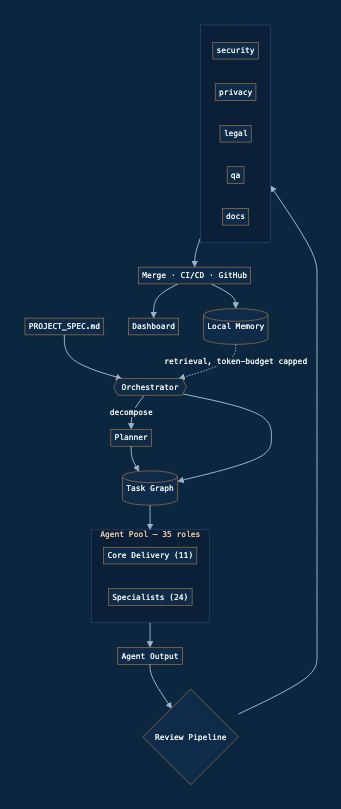

<h1 align="center">
  <br>
  AgentOS-kit
</h1>

<h4 align="center">A multi-agent operating system for software delivery, built for <a href="https://claude.com/claude-code">Claude Code</a> and any orchestrator you point it at.</h4>

<p align="center">
  <a href="LICENSE">
    
  </a>
  <a href="https://www.npmjs.com/package/agentos-kit">
    
  </a>
  <a href="package.json">
    
  </a>
</p>

<p align="center">
  <a href="#quick-start">Quick Start</a> •
  <a href="#status-board">Status Board</a> •
  <a href="#how-it-works">How It Works</a> •
  <a href="#the-roster">Roster</a> •
  <a href="#case-study">Case Study</a> •
  <a href="#documentation">Documentation</a> •
  <a href="#extending-agentos">Extending</a> •
  <a href="#license">License</a>
</p>

<p align="center">
  AgentOS coordinates 35 specialized AI agents under one orchestrator, working against a shared task graph, gated by a review pipeline, provider-agnostic across model backends, and wired into the tools you already use.
</p>

---

## Quick Start

Install with a single command:

```bash
npx agentos-kit
```

Or clone directly:

```bash
git clone https://github.com/chithudas/agentos-kit.git
```

Or curl into an existing project:

```bash
curl -fsSL https://raw.githubusercontent.com/chithudas/agentos-kit/main/install.sh | bash -s -- agentos
```

All three do the same thing: drop the full framework into `./agentos` (or a target directory you name) **and** drop a status board — `agentos-status.html` — right at your project's root, no digging through subfolders required. No runtime dependencies get pulled in — it's markdown and JSON, not code.

> **Note:** AgentOS is a spec, not a runtime. There's nothing to start or daemonize — installing it just puts the framework's files (and the status board) in your project for an orchestrator (a Claude Code session, a custom agent runner, whatever you're using) to read and act on.

Then:

1. Pick the closest starting point from [`templates/`](templates/) — `web-saas.md`, `mobile-app.md`, `api-service.md`, or `data-pipeline.md` — and copy it over [`PROJECT_SPEC.md`](PROJECT_SPEC.md).
2. Fill in the bracketed specifics — summary, architecture, constraints, milestones.
3. Hand [`AgentOS_MASTER_BUILD_SPEC.md`](AgentOS_MASTER_BUILD_SPEC.md) and your filled-in `PROJECT_SPEC.md` to your orchestrator ([`prompts/orchestrator.md`](prompts/orchestrator.md) is its system prompt).
4. It decomposes work into tasks and starts dispatching to the roster below.

**Key Features:**

- 🧩 **35-Agent Roster** — 11 core delivery roles + 24 specialists, each with a capability spec and a runtime system prompt
- 🗺️ **Task Graph Scheduling** — a real dependency DAG with cycle detection and critical-path ordering, not a flat queue
- 🛡️ **Review Pipeline** — security, privacy, legal, qa, and docs gate every merge before it happens
- 🔌 **Provider-Agnostic** — Anthropic, OpenAI, and Google adapters behind one interface; tasks target a tier, not a model
- 🧠 **Local Memory** — compressed, retrieval-based, token-budget capped; no full-history replay
- 🔧 **Plugin SDK** — add third-party agents, tools, or workflow steps without forking the core
- 📊 **Live Dashboard** — a reference implementation of task/review status, ready to wire to a real backend
- 🔗 **MCP Integration** — agents reach external tools through the Model Context Protocol, scoped per role

---

## Status Board

Every install — `npx agentos-kit`, the curl script, or `install.sh` — always drops three files at your project's root, next to your own files, not buried inside the `agentos/` subdirectory: `agentos-status.html` (the dashboard), `status-server.js` (a real, zero-dependency Node server), and `agentos-tasks.json` (the task ledger).

```bash
node status-server.js
# open http://localhost:4500
```



This is a working live board, not a static mockup — `status-server.js` polls `agentos-tasks.json` and serves it over `/api/tasks`; the page re-fetches every few seconds. Whatever you're using as orchestrator (a Claude Code session, a custom runner) writes [`TASK_SCHEMA.json`](TASK_SCHEMA.json)-shaped entries to that file as it dispatches and completes work, and the board reflects it in real time — the same pattern used to build and review AgentOS's own reference NexusChat build. The ledger ships empty; until something writes to it, the page shows its baked-in sample data, clearly labeled as a preview rather than real progress. If any of the three files already exists at your root, the installer skips it and says so rather than overwriting it.

---

## Case Study

**[docs/CASE_STUDY.md](docs/CASE_STUDY.md) — Building NexusChat with AgentOS: a real run-through.** Not a hypothetical walkthrough — what actually happened installing this into an empty repo and building a WhatsApp-style messaging app with it. Every claim in it traces back to a real command, a real curl request, or a real subagent report.

What it covers:
- A `doc/` folder with ~120 files that looked like a complete spec — and turned out to be mostly unfilled scaffolding (`FR-042: Functional requirement placeholder.` ×200). Why reading before trusting a spec folder matters.
- Why the first vertical slice (schema → API → UI) had to be dispatched **sequentially**, not in parallel — each stage genuinely needed the last one's output.
- The mid-build correction after direct feedback that agents weren't running in parallel: the real fix wasn't "just parallelize everything," it was finding work that's actually safe to parallelize — read-only review, where twenty agents reading twenty different files can't collide.
- The **blocker and four high-severity bugs** that twenty-agent review pass caught in code already called "verified working" — an unthrottled OTP brute-force path, an unguarded authorization check, a cross-conversation data leak, and more — plus how each was fixed and re-verified.
- Seven concrete lessons distilled at the end, from "sequence by real dependency, not by habit" to "watch the dashboard."

---

## Documentation

### Getting Started
- **[AgentOS_MASTER_BUILD_SPEC.md](AgentOS_MASTER_BUILD_SPEC.md)** — entry point, the map of every other document
- **[PROJECT_SPEC.md](PROJECT_SPEC.md)** — per-project scope template
- **[PROJECT_TEMPLATES.md](PROJECT_TEMPLATES.md)** + **[templates/](templates/)** — starting points per project archetype
- **[docs/CASE_STUDY.md](docs/CASE_STUDY.md)** — a real run-through: building a messaging app with AgentOS, including the mistakes, the parallelism correction, and the real bugs a review pass caught

### Core Contracts
- **[AGENT_CONTRACT.md](AGENT_CONTRACT.md)** — rules every agent follows, regardless of role
- **[CODING_STANDARDS.md](CODING_STANDARDS.md)** — conventions for every code-producing agent
- **[REVIEW_PIPELINE.md](REVIEW_PIPELINE.md)** — how output is gated before merge
- **[WORKFLOW_LIBRARY.md](WORKFLOW_LIBRARY.md)** + **[workflows/](workflows/)** — vertical-slice, bugfix, release, hotfix

### Architecture
- **[ORCHESTRATOR_SPEC.md](ORCHESTRATOR_SPEC.md)** — scheduling, escalation, backpressure, conflict resolution
- **[STATE_MACHINES.md](STATE_MACHINES.md)** — every valid task/release/review state transition
- **[TASK_GRAPH.md](TASK_GRAPH.md)** — how tasks form a dependency DAG and get scheduled
- **[TASK_SCHEMA.json](TASK_SCHEMA.json)** / **[AGENT_OUTPUT_SCHEMA.json](AGENT_OUTPUT_SCHEMA.json)** — the wire format between orchestrator and agents
- **[MEMORY_ARCHITECTURE.md](MEMORY_ARCHITECTURE.md)** — local, compressed, retrieval-based memory

### Extending & Integrating
- **[PLUGIN_SDK.md](PLUGIN_SDK.md)** — add third-party agents, tools, or workflow steps
- **[MCP_INTEGRATION.md](MCP_INTEGRATION.md)** — reach external tools via the Model Context Protocol
- **[providers/](providers/)** — model provider adapters (Anthropic, OpenAI, Google) and the interface they implement
- **[GITHUB_INTEGRATION.md](GITHUB_INTEGRATION.md)**, **[VSCODE_INTEGRATION.md](VSCODE_INTEGRATION.md)**, **[CICD_AUTOMATION.md](CICD_AUTOMATION.md)** — tool integrations
- **[DASHBOARD_SPEC.md](DASHBOARD_SPEC.md)** + **[dashboard/dashboard-template.html](dashboard/dashboard-template.html)** — live task/review status view

---

## How It Works

**Core Components:**

1. **Orchestrator** — the only role that reads `PROJECT_SPEC.md`, assigns tasks, and can escalate to a human
2. **Task Graph** — tasks form a dependency DAG; independent work dispatches in parallel, dependent work waits its turn
3. **35-Agent Roster** — one capability spec + one system prompt per role, each scoped to a `file_scope` and a model tier
4. **Review Pipeline** — schema validation → scope check → tests → flagged reviews → orchestrator sign-off
5. **Provider Adapters** — a task targets `fast` / `standard` / `deep`, not a specific model or vendor
6. **Local Memory** — durable takeaways get compressed to a few sentences, embedded, and retrieved only when relevant — never replayed in full

<p align="center">
  
</p>

---

## The Roster

**Core delivery (11):** orchestrator, planner, backend, frontend, mobile, database, security, privacy, legal, qa, docs

**Specialists (24):** ios-specialist, android-specialist, api-designer, graphql-architect, devops-engineer, sre-engineer, release-engineer, incident-responder, dependency-manager, finops-engineer, i18n-engineer, accessibility-engineer, performance-engineer, prompt-engineer, ml-engineer, data-engineer, cloud-architect, observability-engineer, code-reviewer, refactoring-specialist, test-automation-engineer, build-engineer, ui-designer, auth-identity-engineer

Full detail, tiers, and default review requirements: **[agents/AGENT_INDEX.md](agents/AGENT_INDEX.md)**.

---

## Extending AgentOS

- **New agent or tool** — see [`PLUGIN_SDK.md`](PLUGIN_SDK.md).
- **New project type** — add a file to [`templates/`](templates/) following the existing ones' structure.
- **New provider** — implement the interface in [`providers/PROVIDER_ADAPTER_SPEC.md`](providers/PROVIDER_ADAPTER_SPEC.md).

---

## Author

Built by **Chidambara Das Ganesan Nageswari** — [@chithudas](https://github.com/chithudas)

---

## License

[MIT](LICENSE)
